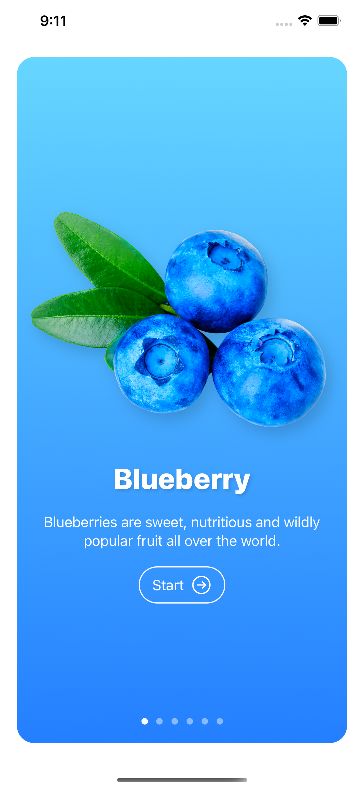
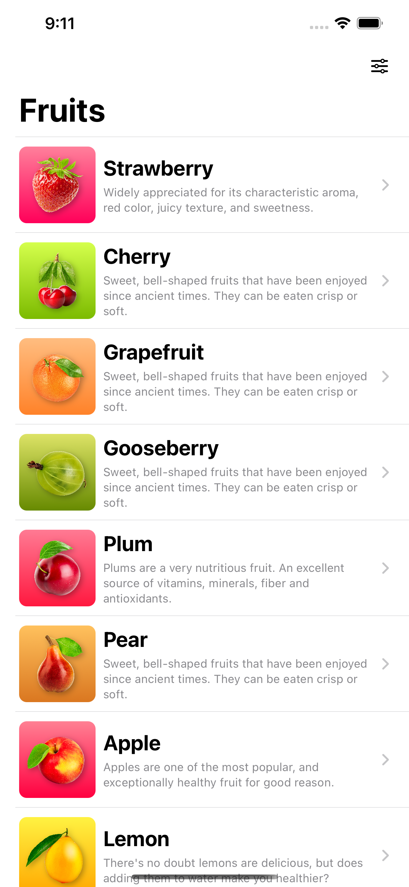
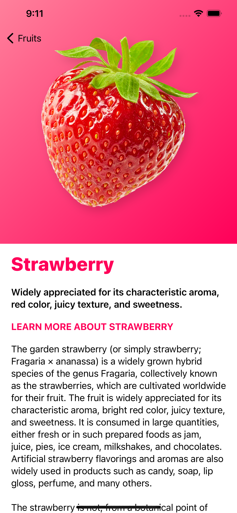
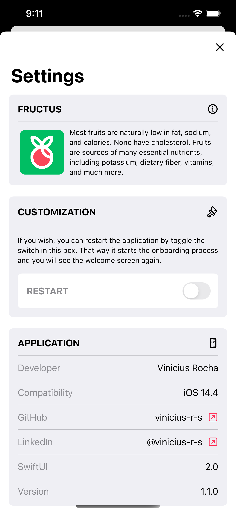

<h1 align="center">
  
</h1>
<h2 align="center">
  Fructus
</h2>

<h4 align="center" style="margin-bottom: 48px;">An App written with Swift 2.0 to pratice and learn.</h4>

<p align="center">
  <a href="#rocket-languages-and-tools">Languages and Tools</a> •
  <a href="#computer-how-to-use">How To Use</a> •
  <a href="#mailbox_with_mail-credits">Credits</a>
</p>

<h1 align="center">
    
    
    
    
</h1>

## :rocket: Languages and Tools

<p align="left">
  <a href="https://developer.apple.com/swift/" target="_blank"> 
     
  </a> 
  <a href="https://developer.apple.com/xcode/" target="_blank"> 
     
  </a>
</p>

## :computer: How To Use
To clone and run this application, you'll need Git and XCode installed on your MAC. From your command line:

```bash
# Clone this repository
$ git clone https://github.com/vinicius-r-s/fructus-swift.git

# Go into the repository
$ cd fructus-swift

# Run the app
Press Start in XCode
```

## :mailbox_with_mail: Credits

Follow the original author:
<a href="https://swiftuimasterclass.com/" style="color: #FD2B53;" target="_blank">Robert Petras - SwiftUI Masterclass</a>